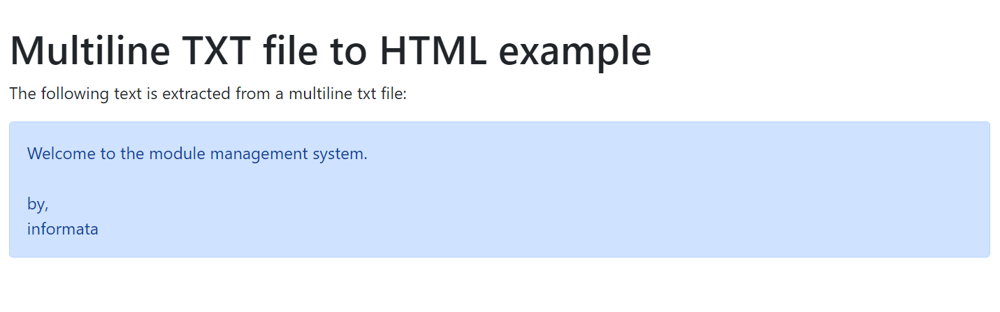
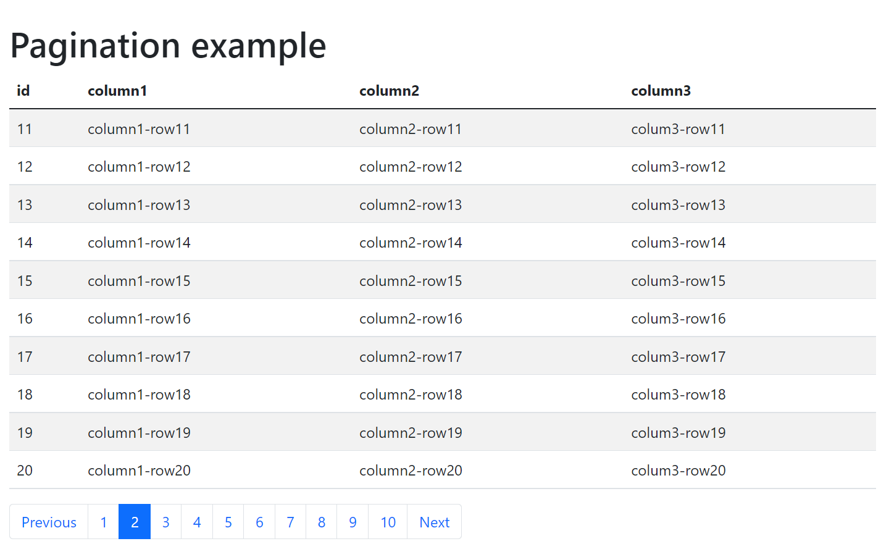

# PHP Fragments

This repo contains a collection of PHP fragments to show how to solve some questions that people did it to me.

The folders are named with the questions:

## txt-to-html

 Showing how to read a multiline txt file and showing in a html multiline paragraph.

 

 See the sample here: [txt-to-html](https://www.informata.es/github/php-fragments/txt-to-html/txt-to-html.php)

## pagination-page

 Showing data of a database table in a pagination page with PHP and SQLite

 

See the sample here: [pagination-page](https://www.informata.es/github/php-fragments/pagination-page/pagination-page.php)

## sqlite-in-replit

 Script to install SQLite support on replit.io environment.

 To run the script, in the console type:

```bash
wget -O - https://raw.githubusercontent.com/informata/php-fragments/main/sqlite-in-replit/sqlite-in-replit.sh | bash
```
This script is an updated version of the original [this one](https://github.com/ethanpil/php-with-sqlite-on-replit).